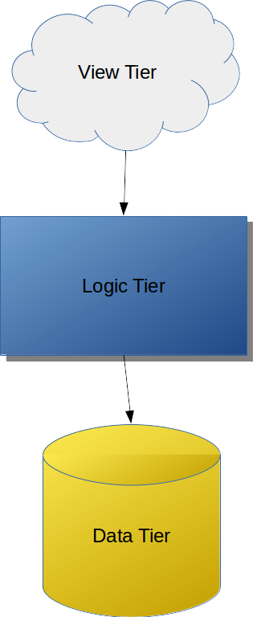
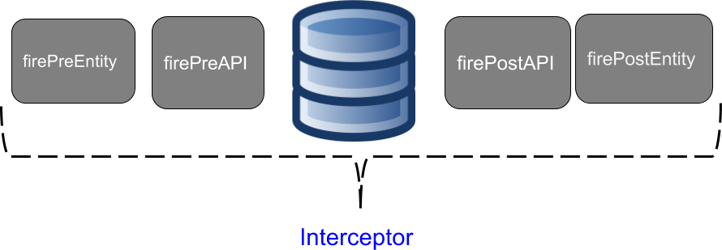

# README

Uma vez discutido da importância da padronização das APIs dos bancos não relacionais, o próximo passo é discutir mais detalhes sobre elas. Porém, para facilitar a explicação da solução deste projeto, primeiro é importante entender que geralmente uma aplicação é divida em camadas para facilitar a sua organização, manutenção e divisão das responsabilidades da aplicação, é muito comum encontrar uma aplicação dividida em camadas quando ela é muito complexa.

Está nova API Java será responsável por realizar a comunicação entre a camada lógica e a de dados, para isso, ela será dividida em duas partes, uma para comunicação entre o banco e outra responsável pela alta abstração na aplicação.

Acima podemos visualizar uma abstração da camada física de uma aplicação, é muito comum encontrar uma aplicação que possua multi-camadas físicas, geralmente dividida em três:

* **Camada de apresentação**: A sua principal responsabilidade é traduzir as atividades de uma forma que o usuário possa entender.
* **Camada lógica**: A camada lógica é onde fica localizada toda a lógica de negócio e processamento, condições, salva informação, essa a camada que move e processa informações entre as camadas.
* **Camada de dados**: Essa camada é responsável por armazenar e recuperar as informações dentro de um banco de dados ou sistema de arquivo.

Falando precisamente da camada física, tier, lógica. Para se separar as responsabilidades, existem as camadas, layer, lógicas. Essas camadas contêm a ponte entre a camada física de apresentarão e a camada de dados além da lógica de negócio. Indiferente do seu padrão de arquitetura \(MVC, HMVC, PAC, MVA, MVP, MVVM\) eles possuem no mínimo quatro camadas:

* **Camada de aplicação**: A ponte para a camada física de apresentação, por exemplo, responsável por transformar o objeto em JSON ou XML.
* **Camada de serviço**: A camada de serviço, a depender da tecnologia utilizada pode ser um Controller ou um Resource.
* **Camada de negócio**: Local onde contém toda a lógica de negócio e o modelo.
* **Camada de persistência**: A ponte entre a camada física de acesso aos dados e a camada física lógica.

Olhando para a camada de persistência, ela possui suas próprias camadas: O DAO, Data Access Object, que é a camada responsável por realizar a ligação entre a camada de persistência e a de negócio. É nela que contém a API e as chamadas para o banco de dados. Atualmente existe uma diferença entre os bancos relacionais e não relacionais:

No mundo relacional existem dois mecanismo, além do DAO, que são o JDBC e o JPA:

* **JDBC:** Responsável por uma camada de baixo nível com o banco de dados. É nela que contém a transação, os parses, a comunicação com o banco de dados em si, basicamente é o “driver” do banco de dados etc.
* **JPA:** É a camada de alto nível com o banco de dados. É nela que fica a comunicação entre o JDBC e a aplicação Java. Boa parte dessa camada é definida por anotações e é nela também que contém a integração/comunicação com as outras especificações como o CDI e o bean validation.

  A vantagem dessas camadas é que a mudança, seja do driver ou do JPA, acontece de forma transparente. Por exemplo, ao realizar a mudança do banco de dados, basta apenas trocar pelo seu respectivo driver e a camada de JPA e o DAO ficam intactas. Assim, caso exista um novo banco de dados, basta que o distribuidor crie apenas o respectivo JDBC sem se preocupar com as outras camadas. O mesmo acontece com o JPA, caso um destruidor de solução técnica para Java queria criar o seu próprio JPA, ele não precisa se preocupar com os detalhes de cada banco de dados, apenas focar na solução de alto nível com o JPA.

  No mundo dos bancos NoSQL, infelizmente, isso não acontece. Como todas as APIs são diferentes toda mudança de banco resulta na troca de API e assim temos uma grande perda de código. As soluções de hoje em dia \(Spring Data, Hibernate OGM, TopLink NOSQL, etc.\) estão atuando em uma camada de alto nível, logo elas são responsáveis por realizar a comunicação entre o banco de dados e a aplicação Java, por isso temos alguns problemas:

* O distribuidor de banco de dados, precisa se preocupar com o código de alta mapeamento de acesso de Java.
* O distribuidor da solução Java, precisa se preocupar com o código de baixo nível para realizar o acesso ao banco de dados.
* O distribuidor do banco de dados, precisa replicar a solução para todos provedores de solução Java.
* O desenvolvedor Java, fica preso a uma solução de alto nível para facilitar o seu código.
* Caso a camada de alto nível não tenha suporte para o banco de dados o desenvolvedor terá que ou mudar de solução Java ou mesmo fazer a chamada diretamente pela API do banco de dados, ou seja, haverá uma grande perda de código.

A solução para esse problema é , assim como no mundo relacional, ter duas camadas de API:

* Uma camada de baixo nível ou camada de comunicação: que seria o driver de comunicação entre o banco e o Java. Essa camada teria quatro especializações \(uma para cada tipo de banco de dados\).
* Uma camada de alto nível ou camada de mapeamento: Responsável pelo mapeamento para o desenvolvedor Java. É nessa camada que ficar as anotações, o EntityManager, etc.

Com essa abordagem temos algumas vantagens:

* O distribuidor do banco de dados, precisa se preocupar com a comunicação e o parser para o Java.
* O distribuidor da solução Java, precisa se preocupar apenas com a API de mapeamento.
* O desenvolvedor Java não fica preso nem ao banco de dados e nem a API de mapeamento.

Essas APIs serão opcionais uma da outra, em outras palavras, um distribuidor só precisa se preocupar com a camada do seu interesse.

## Nasce o Projeto JNoSQL

O JNoSQL é uma API Java flexível e extensiva cujo o objetivo é realizar comunicações entre a aplicação e o banco de dados NoSQL. Assim, o seu foco será criar uma API comum, porém, olhando para a diversidade que existe dentro do mundo NoSQL, mesmo para os bancos do mesmo tipo. Atualmente sabemos que mesmo um banco de dados sendo do mesmo tipo, família de colunas, existem recursos que são específicos de um determinado banco de dados é o caso, por exemplo, do Cassandra Query Language ou mesmo nível de consistência que existe apenas no Cassandra. A API terá como missão ser extensível e configurável sendo apta para utilizar recursos específicos de um banco de dados. Para atacar esse problema o projeto será composto de duas camadas core:

* **A camada de comunicação:** A API que realiza a comunicação com o banco de dados, em analogia, seria o que o JDBC faz para o SQL. Essa API será subcomposta inicialmente de quatro partes, uma para cada tipo de banco de dados NoSQL.
* **A camada de mapeamento:** Uma API que realiza a integração entre outras ferramentas, assim será o melhor amigo para o desenvolvedor Java. Essa API será focada em anotações e integração com outras tecnologias, por exemplo, Bean validation. O seu coração será baseado em CDI.

### Diana

O projeto Diana tem como objetivo tratar apenas da camada de baixo nível, ou seja, a camada de comunicação com os bancos não relacionais. A ideia que esse projeto funcione como um driver para os bancos de dados não relacionais. De modo geral ela possuirá quatro APIs, uma para cada tipo de banco de dados, além do seu respectivo TCK. O Kit de teste de compatibilidade tem como objetivo afirmar que um determinado banco de dados implementa uma das APIs corretamente, por exemplo, caso o banco X implemente a API de chave valor e passar nos testes de compatibilidade quer dizer que ele está compatível. O motivo que o projeto abrangerá apenas a API de comunicação são:

* O desenvolvedor não quer aprender uma nova API além do JPA.
* O objetivo da camada de comunicação é um escopo bem grande uma vez que se tem diversos tipos de bancos de dados e diversas implementações.
* Facilitar a implementação com as camadas de mapeamento já existentes, além de iniciar as conversas sobre esse tipo de padronização.

### Artemis

O Artemis é a camada de integração, ou seja, ele será responsável por se comunicar com a camada de comunicação, o diana, e realizar a integração com outras tecnologias, como Bean Validation, por exemplo. O seu coração é composto com CDI. Assim, sua fórmula é simples:

Diana mais CDI igual ao Artemis.

Assim como o Diana, ela também possui, de maneira geral, um pacote para cada tipo de banco de dados. Utilizando como base o CDI ele se caracteriza por ser compartimentalizável além de ser possível criar eventos para cada momento da persistência do objeto. Com Artemis será possível:

* Persistir seu objeto utilizando simples anotações
* Substituir o grande número de componentes \(reflections, a conversão da entidade para o banco de dados, como armazena o cache, ciclo de eventos ao persistir uma informação, dentre outros\).
* Ouvir eventos para cada ciclo de persistência no banco de dados \(Diferentes eventos para cada tipo de banco de dados\).
* Criar classes interceptadoras para as classes repositório.

Um ponto importante sobre os eventos no CDI é a facilidade de adicionar novo recursos ou funcionalidades de maneira transparente ao código. Por exemplo, é possível injetar a validação das entidades, bean validation, sem ser necessário mudar nenhum fluxo do código atual. Por padrão, o fluxo de evento segue o seguinte fluxo:

Cada tipo de banco de dados, possui os seus próprios interceptors e eventos, ou seja, é possível realizar a mudança apenas dos eventos do chave-valor sem modificar escutar os eventos do tipo grafo.

